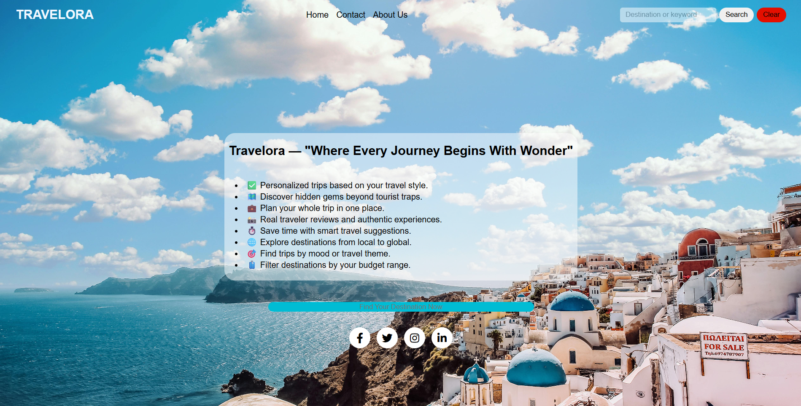

<h1 align="center">🌍 TravelApp – Travel Recommendation Web Application ✈️</h1>

  
  
  

  <strong>Explore the world with ease 🌎</strong> 
  A responsive travel recommendation web application built using HTML, CSS, and JavaScript. It allows users to search for destinations by keyword and get smart, location-based suggestions in real time.

  🔗 <a href="https://inikhilchoudhary.github.io/TravelApp/">Live Demo</a>

---

## 📸 Preview

  

---

## 🔧 Features

- ✅ Fully responsive and interactive UI
- 🔍 Keyword-based destination search (`beach`, `mountain`, `temple`, etc.)
- 🧠 Smart travel recommendations from a JSON API
- 🕒 Real-time local time support (optional feature)
- 📞 Contact Us and ℹ️ About pages
- 🧹 Clear search functionality
- 🔗 Social media icons and links

---

## 📁 Project Structure

